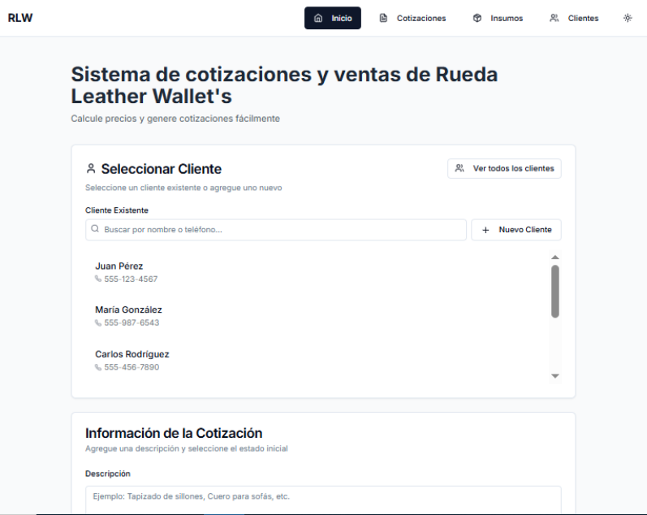

# 📊 Rueda Leather Wallet's - Sistema de Gestión de Ventas y Cotizaciones



Una aplicación web completa para la gestión de cotizaciones, inventario de insumos y análisis de ventas, especialmente diseñada para negocios de talabartería y trabajos en cuero. **Ahora disponible como aplicación de escritorio multiplataforma con actualizaciones automáticas.**

## 🚀 Características Principales

### 💼 Gestión de Cotizaciones

- **Creación de Cotizaciones**: Formulario completo con cálculos automáticos
- **Estados Dinámicos**: Pendiente, Aprobada, Rechazada, En proceso, Completada, Cancelada
- **Generación de PDF**: Cotizaciones profesionales con información de empresa
- **Vista Previa**: Generar PDF sin guardar la cotización

### 👥 Gestión de Clientes

- **Base de Datos de Clientes**: Información completa (nombre, teléfono, email, dirección)
- **Búsqueda Avanzada**: Filtros por nombre, teléfono o email
- **Historial**: Seguimiento de cotizaciones por cliente
- **CRUD Completo**: Crear, leer, actualizar y eliminar clientes

### 📦 Inventario de Insumos

- **Catálogo Completo**: Insumos específicos para talabartería
- **Control de Stock**: Seguimiento de cantidades disponibles
- **Precios Dinámicos**: Precios por volumen y unitarios
- **Integración**: Los insumos se incluyen automáticamente en las cotizaciones

### 📈 Dashboard y Reportes

- **Métricas en Tiempo Real**: Total de ventas, tasa de conversión, clientes activos
- **Análisis por Período**: Filtros por fechas y períodos predefinidos
- **Visualizaciones**: Gráficos de distribución por estado
- **Top Clientes**: Ranking de mejores clientes
- **Exportación**: Reportes en formato JSON

### 🖥️ **NUEVO: Aplicación de Escritorio**

- **Multiplataforma**: Windows, macOS y Linux
- **Actualizaciones Automáticas**: Sistema completo de auto-actualización
- **Menús Nativos**: Integración completa con el sistema operativo
- **Atajos de Teclado**: Navegación rápida con shortcuts
- **Modo Offline**: Funciona sin conexión a internet
- **Instalador Profesional**: Instaladores nativos para cada plataforma

### 🔄 **NUEVO: Sistema de Actualizaciones Automáticas**

- **Verificación Automática**: Busca actualizaciones al iniciar
- **Descarga Opcional**: El usuario decide cuándo descargar
- **Progreso Visual**: Barra de progreso durante la descarga
- **Instalación Flexible**: Instalar ahora o al cerrar la aplicación
- **Notificaciones Nativas**: Alertas del sistema operativo
- **Rollback Seguro**: Verificación de integridad antes de instalar

### 🎨 Interfaz de Usuario

- **Diseño Moderno**: Interfaz limpia y profesional con Tailwind CSS
- **Responsive**: Adaptable a móvil, tablet y escritorio
- **Tema Oscuro/Claro**: Alternancia entre temas
- **Componentes Reutilizables**: Basado en shadcn/ui

## 🛠️ Tecnologías Utilizadas

### Frontend y Core

- **Frontend**: Next.js 14, React 18, TypeScript
- **Styling**: Tailwind CSS, shadcn/ui
- **PDF Generation**: jsPDF, jspdf-autotable
- **Icons**: Lucide React
- **Themes**: next-themes
- **Storage**: JSON files (fácilmente migrable a base de datos)

### Desktop y Actualizaciones

- **Desktop Framework**: Electron 27
- **Auto-Updater**: electron-updater
- **Build System**: electron-builder
- **Process Management**: concurrently, wait-on
- **Security**: Context isolation, preload scripts

## 📁 Estructura del Proyecto

```bash
sales-quotation-manager/
├── app/                          # App Router de Next.js
│   ├── api/                      # API Routes
│   │   ├── clientes/            # Endpoints de clientes
│   │   │   ├── route.ts         # GET, POST clientes
│   │   │   └── [id]/route.ts    # GET, PUT, DELETE cliente específico
│   │   └── cotizaciones/        # Endpoints de cotizaciones
│   │       ├── route.ts         # GET, POST cotizaciones
│   │       └── [id]/route.ts    # GET, PUT, DELETE cotización específica
│   ├── clientes/                # Páginas de clientes
│   │   ├── page.tsx            # Lista de clientes
│   │   ├── nuevo/page.tsx      # Formulario nuevo cliente
│   │   └── [id]/page.tsx       # Detalle de cliente
│   ├── cotizaciones/           # Páginas de cotizaciones
│   │   ├── page.tsx           # Lista de cotizaciones
│   │   └── [id]/page.tsx      # Detalle de cotización
│   ├── dashboard/             # Dashboard de reportes
│   │   └── page.tsx          # Página principal del dashboard
│   ├── insumos/              # Páginas de inventario
│   │   └── page.tsx         # Lista de insumos
│   ├── globals.css          # Estilos globales
│   ├── layout.tsx          # Layout principal
│   └── page.tsx           # Página de inicio
├── components/            # Componentes React
│   ├── ui/               # Componentes base de shadcn/ui
│   │   ├── button.tsx
│   │   ├── card.tsx
│   │   ├── input.tsx
│   │   ├── table.tsx
│   │   └── ...
│   ├── client-form.tsx        # Formulario de selección de cliente
│   ├── client-list.tsx        # Lista de clientes
│   ├── dashboard.tsx          # Componente principal del dashboard
│   ├── footer.tsx             # Pie de página
│   ├── insumos-selector.tsx   # Selector de insumos
│   ├── navbar.tsx             # Barra de navegación
│   ├── quotation-detail.tsx   # Detalle de cotización
│   ├── quotation-list.tsx     # Lista de cotizaciones
│   ├── sales-quotation-form.tsx # Formulario principal de cotizaciones
│   ├── theme-provider.tsx     # Proveedor de temas
│   ├── theme-toggle.tsx       # Botón de cambio de tema
│   └── update-status.tsx      # 🆕 Estado de actualizaciones
├── electron/             # 🆕 Configuración de Electron
│   ├── main.js          # Proceso principal de Electron
│   ├── preload.js       # Script de preload seguro
│   └── package.json     # Dependencias de Electron
├── data/                 # Archivos de datos JSON
│   ├── clientes.json    # Base de datos de clientes
│   ├── cotizaciones.json # Base de datos de cotizaciones
│   └── insumos.json     # Catálogo de insumos
├── utils/               # Utilidades
│   └── pdf-generator.ts # Generador de PDFs
├── lib/               # Librerías y configuraciones
│   └── utils.ts      # Utilidades generales
├── public/           # Archivos estáticos
│   └── icon.ico     # 🆕 Icono de la aplicación
├── package.json      # Dependencias del proyecto
├── next.config.mjs   # 🆕 Configuración de Next.js para Electron
├── tailwind.config.ts # Configuración de Tailwind
├── tsconfig.json     # Configuración de TypeScript
└── README.md         # Este archivo
```

## 🚀 Instalación

### Prerrequisitos

- Node.js 18+
- npm o yarn

### Opción 1: Aplicación de Escritorio (Recomendado)

#### Descargar Aplicación Compilada

1. **Ir a [Releases](https://github.com/ivanruedas85/cotizaciones_rlw/releases)**
2. **Descargar para tu plataforma**:
   - **Windows**: `GestorVentas-Setup-1.0.0.exe`
   - **macOS**: `GestorVentas-1.0.0.dmg`
   - **Linux**: `GestorVentas-1.0.0.AppImage`
3. **Instalar y ejecutar**

#### Características de la Aplicación de Escritorio

- ✅ **Instalación nativa** en Windows, macOS y Linux
- ✅ **Actualizaciones automáticas** integradas
- ✅ **Menús nativos** con atajos de teclado
- ✅ **Modo offline** completo
- ✅ **Integración con el sistema** operativo

### Opción 2: Desarrollo Local

#### Pasos de Instalación

1. **Clonar el repositorio**

```bash
git clone https://github.com/ivanruedas85/cotizaciones_rlw/
cd cotizaciones_rlw
```

2. **Instalar dependencias**

```bash
npm install
# o
yarn install
```

3. **Configurar el entorno**

```bash
# Los archivos JSON ya están incluidos en /data
# No se requiere configuración adicional
```

4. **Ejecutar en modo desarrollo**

```bash
npm run dev
# o
# o
yarn dev
```

5. **Abrir en el navegador**

**Para desarrollo web:**

```bash
http://localhost:3000
```

**Para desarrollo de escritorio:**

```bash
npm run electron-dev
# o
yarn electron-dev
```

6. **Abrir en el navegador** (solo modo web)

```bash
http://localhost:3000
```

## 🔧 Scripts Disponibles

### Scripts Web

```bash
npm run dev      # Ejecutar en modo desarrollo web
npm run build    # Construir para producción web
npm run start    # Ejecutar versión de producción web
npm run lint     # Verificar código con ESLint
```

### 🆕 Scripts de Escritorio

```bash
npm run electron          # Ejecutar aplicación de escritorio
npm run electron-dev      # Desarrollo con hot-reload
npm run build-electron    # Construir aplicación de escritorio
npm run dist             # Crear instaladores para distribución
npm run pack             # Empaquetar sin crear instaladores
```

### 🆕 Scripts de Distribución por Plataforma

```bash
# Windows
npm run build-electron -- --win

# macOS  
npm run build-electron -- --mac

# Linux
npm run build-electron -- --linux

# Todas las plataformas
npm run build-electron -- --win --mac --linux
```

## 🔄 Sistema de Actualizaciones Automáticas

### Configuración de Actualizaciones

#### 1. **Configurar Repositorio GitHub**

En `package.json`, actualizar la sección `publish`:

```json
{
  "build": {
    "publish": {
      "provider": "github",
      "owner": "tu-usuario-github",
      "repo": "gestorventas-desktop"
    }
  }
}
```

#### 2. **Crear GitHub Token**

1. Ir a GitHub Settings → Developer settings → Personal access tokens
2. Crear token con permisos `repo`
3. Configurar variable de entorno:

```bash
export GH_TOKEN="tu-github-token"
```

#### 3. **Publicar Release**

```bash
# Construir y publicar automáticamente
npm run build-electron -- --publish=always

# Solo construir (sin publicar)
npm run dist
```

### Flujo de Actualizaciones

#### **Para Usuarios:**

1. **Verificación Automática**: Al abrir la app, verifica actualizaciones
2. **Notificación**: Diálogo nativo informa sobre nueva versión
3. **Opciones de Descarga**:
   - ✅ Descargar ahora
   - ✅ Descargar en segundo plano
   - ✅ Más tarde
4. **Progreso Visual**: Barra de progreso durante descarga
5. **Instalación**:
   - ✅ Reiniciar ahora
   - ✅ Instalar al cerrar

#### **Para Desarrolladores:**

1. **Incrementar versión** en `package.json`
2. **Construir release**: `npm run build-electron -- --publish=always`
3. **GitHub Actions** (opcional): Automatizar el proceso
4. **Usuarios reciben actualización** automáticamente

### Componente de Estado de Actualizaciones

Agregar a cualquier página:

```tsx
import { UpdateStatus } from "@/components/update-status"

export default function MiPagina() {
  return (
    <div>
      {/* Otros componentes */}
      <UpdateStatus />
    </div>
  )
}
```

**Características:**

- 🔍 Detecta automáticamente si está en Electron
- 📊 Muestra versión actual
- 📈 Progreso de descarga en tiempo real
- 🎛️ Botones para verificar, descargar e instalar

## 📖 Uso de la Aplicación

### 1. Gestión de Clientes

### 🆕 Atajos de Teclado (Solo Aplicación de Escritorio)

#### Navegación

- `Ctrl+H` (Cmd+H en Mac): Ir a Inicio
- `Ctrl+1`: Ir a Cotizaciones
- `Ctrl+2`: Ir a Clientes
- `Ctrl+3`: Ir a Insumos
- `Ctrl+4`: Ir a Dashboard

#### Acciones

- `Ctrl+N`: Nueva Cotización
- `Ctrl+Shift+N`: Nuevo Cliente
- `Ctrl+R`: Recargar página
- `F11` (Ctrl+Cmd+F en Mac): Pantalla completa
- `Ctrl+Shift+I`: Herramientas de desarrollador

#### Sistema

- `Ctrl+Q` (Cmd+Q en Mac): Salir de la aplicación

### 🆕 Menús Nativos

#### Archivo

- Nueva Cotización
- Nuevo Cliente
- Salir

#### Ver

- Navegación a todas las secciones
- Recargar
- Pantalla completa

#### Herramientas

- **🆕 Verificar Actualizaciones**: Buscar actualizaciones manualmente
- Exportar/Importar datos
- Herramientas de desarrollador

#### Ayuda

- Acerca de GestorVentas
- Documentación
- **🆕 Reportar Problema**: Link directo a GitHub Issues

### 1.Gestión de Clientes

#### Agregar Nuevo Cliente

1. Navegar a **Clientes** → **Nuevo Cliente** (o `Ctrl+Shift+N`)
2. Completar el formulario con:
   - Nombre (obligatorio)
   - Teléfono (obligatorio)
   - Email (opcional)
   - Dirección (opcional)
3. Hacer clic en **Guardar Cliente**

#### Gestionar Clientes Existentes

- **Ver Lista**: Ir a la sección **Clientes** (o `Ctrl+2`)
- **Buscar**: Usar la barra de búsqueda por nombre, teléfono o email
- **Editar**: Hacer clic en el ícono de edición
- **Eliminar**: Hacer clic en el ícono de papelera (con confirmación)

### 2. Crear Cotizaciones

#### Proceso Paso a Paso

1. **Ir a Inicio** para crear nueva cotización
2. **Seleccionar Cliente**:
   - Buscar cliente existente
   - O crear nuevo cliente si es necesario
3. **Agregar Descripción** del trabajo a realizar
4. **Seleccionar Estado** inicial (generalmente "Pendiente")
5. **Calcular Precio**:
   - Ingresar precio de la piel
   - Especificar dimensiones (alto x largo)
   - Seleccionar porcentaje adicional
6. **Agregar Insumos** (pestaña Insumos):
   - Buscar insumos necesarios
   - Agregar cantidades requeridas
   - El sistema calcula automáticamente el total
7. **Guardar Cotización**

#### Fórmulas de Cálculo

- **Precio Unitario** = precio\_piel × 1 ÷ 100
- **Precio Residuo** = alto × largo ÷ 100  
- **Total Residuo** = precio\_residuo + (precio\_residuo × porcentaje\_adicional ÷ 100)
- **Total Final** = (precio\_unitario × total\_residuo) + valor\_insumos

### 3. Gestión de Cotizaciones

#### Ver y Administrar Cotizaciones

1. **Ir a Cotizaciones** para ver la lista completa
2. **Filtrar** por estado o buscar por cliente/descripción
3. **Cambiar Estado**: Usar el dropdown en cada cotización
4. **Generar PDF**: Hacer clic en el ícono de documento
5. **Descargar**: Usar el ícono de descarga
6. **Eliminar**: Ícono de papelera (con confirmación)

#### Estados de Cotización

- **Pendiente**: Cotización creada, esperando respuesta
- **Aprobada**: Cliente aprobó la cotización
- **En proceso**: Trabajo en desarrollo
- **Completada**: Trabajo terminado y entregado
- **Rechazada**: Cliente rechazó la cotización
- **Cancelada**: Cotización cancelada por cualquier motivo

### 4. Dashboard y Reportes

#### Acceder al Dashboard

1. **Ir a Cotizaciones** → **Dashboard**
2. El dashboard muestra métricas en tiempo real

#### Métricas Disponibles

- **Total de Ventas**: Suma de cotizaciones completadas/aprobadas
- **Total de Cotizaciones**: Cantidad total de cotizaciones
- **Tasa de Conversión**: Porcentaje de cotizaciones exitosas
- **Clientes Activos**: Número de clientes únicos

#### Filtros y Reportes

- **Filtrar por Período**: Últimos 7, 30, 90 días o año completo
- **Rango de Fechas**: Seleccionar fechas específicas
- **Exportar Reporte**: Descargar datos en formato JSON
- **Top Clientes**: Ver los 5 mejores clientes del período

### 5. Inventario de Insumos

#### Ver Inventario

1. **Ir a Insumos** para ver el catálogo completo
2. **Información Disponible**:
   - Nombre del insumo
   - Precio por volumen
   - Cantidad disponible
   - Precio unitario
   - Descripción

#### Insumos Incluidos

- Cuero vacuno
- Hilo encerado  
- Remaches metálicos
- Tinte para cuero
- Hebillas de metal
- Pegamento especial
- Cera de acabado
- Agujas para cuero

## 🎨 Personalización

### Cambiar Tema

- Usar el botón de sol/luna en la barra de navegación
- El tema se guarda automáticamente

### Modificar Insumos

- Editar el archivo \`data/insumos.json\`
- Agregar nuevos insumos con la estructura:

```json
{
  "id": "9",
  "nombre": "Nuevo Insumo",
  "precio_volumen": 1000,
  "cantidad_volumen": 100,
  "precio_unidad": 10,
  "descripcion": "Descripción del insumo"
}
```

### Información de la Empresa

- Modificar \`utils/pdf-generator.ts\`
- Cambiar los datos en \`companyInfo\`:

```typescript
const companyInfo = {
  name: "Tu Empresa S.A.",
  address: "Tu Dirección",
  phone: "Tu Teléfono",
  email: "tu@email.com",
  website: "www.tuempresa.com",
  taxId: "Tu RFC/NIT"
}
```

### 🆕 Personalizar Aplicación de Escritorio

#### Cambiar Icono

1. Reemplazar `public/icon.ico` (Windows)
2. Agregar `public/icon.png` (Linux/macOS)
3. Reconstruir: `npm run build-electron`

#### Modificar Información de la App

En `package.json`:

```json
{
  "name": "tu-app-name",
  "description": "Tu descripción",
  "build": {
    "appId": "com.tuempresa.tuapp",
    "productName": "Tu App Name"
  }
}
```

## 📦 Dependencias Principales

### Core Dependencies

```json
{
  "next": "14.0.0",
  "react": "^18",
  "typescript": "^5",
  "tailwindcss": "^3",
  "jspdf": "^2.5.1",
  "jspdf-autotable": "^3.8.0",
  "lucide-react": "^0.292.0",
  "next-themes": "^0.2.1"
}
```

### 🆕 Desktop Dependencies

```json
{
  "electron": "^27.0.0",
  "electron-builder": "^24.6.4",
  "electron-updater": "^6.1.4",
  "concurrently": "^8.2.2",
  "wait-on": "^7.2.0"
}
```

## 🚀 Despliegue

### 🆕 Aplicación de Escritorio

#### Construcción Local

```bash
# Todas las plataformas
npm run dist

# Plataforma específica
npm run build-electron -- --win    # Windows
npm run build-electron -- --mac    # macOS
npm run build-electron -- --linux  # Linux
```

#### Distribución Automática

```bash
# Publicar en GitHub Releases
npm run build-electron -- --publish=always

# Solo construir sin publicar
npm run build-electron -- --publish=never
```

#### Configuración de CI/CD (GitHub Actions)

Crear `.github/workflows/build.yml`:

```yaml
name: Build and Release

on:
  push:
    tags:
      - 'v*'

jobs:
  build:
    runs-on: ${{ matrix.os }}
    strategy:
      matrix:
        os: [windows-latest, macos-latest, ubuntu-latest]
    
    steps:
      - uses: actions/checkout@v3
      - uses: actions/setup-node@v3
        with:
          node-version: '18'
      
      - run: npm install
      - run: npm run build-electron -- --publish=always
        env:
          GH_TOKEN: ${{ secrets.GITHUB_TOKEN }}
```

### Aplicación Web

#### Vercel (Recomendado)

1. Conectar repositorio a Vercel
2. Configurar variables de entorno si es necesario
3. Desplegar automáticamente

#### Otros Proveedores

- **Netlify**: Compatible con Next.js
- **Railway**: Soporte completo para Next.js
- **Heroku**: Requiere configuración adicional

## 🔄 Migración a Base de Datos

Para migrar de archivos JSON a una base de datos real:

1. **Elegir Base de Datos**: PostgreSQL, MySQL, MongoDB
2. **ORM**: Prisma, Drizzle, o Mongoose
3. **Modificar API Routes**: Cambiar lectura/escritura de archivos por consultas DB
4. **Variables de Entorno**: Configurar conexión a BD

### 🆕 Consideraciones para Aplicación de Escritorio

- **SQLite**: Ideal para aplicaciones de escritorio
- **Electron Store**: Para configuraciones simples
- **Archivos locales**: Los datos se mantienen en el dispositivo del usuario

## 🛡️ Seguridad

### 🆕 Seguridad en Aplicación de Escritorio

- ✅ **Context Isolation**: Aislamiento de contexto habilitado
- ✅ **Node Integration**: Deshabilitado en renderer
- ✅ **Preload Scripts**: APIs expuestas de forma segura
- ✅ **CSP**: Content Security Policy configurado
- ✅ **Actualizaciones Verificadas**: Firmas digitales validadas

### Seguridad Web

- ✅ **HTTPS**: Obligatorio en producción
- ✅ **Validación de entrada**: En todos los formularios
- ✅ **Sanitización**: De datos antes de almacenar

## 🤝 Contribución

1. Fork del proyecto
2. Crear rama para nueva funcionalidad (`git checkout -b feature/nueva-funcionalidad`)
3. Commit de cambios (`git commit -m 'Agregar nueva funcionalidad'`)
4. Push a la rama (`git push origin feature/nueva-funcionalidad`)
5. Crear Pull Request

### 🆕 Contribuir a la Aplicación de Escritorio

- Probar en múltiples plataformas (Windows, macOS, Linux)
- Verificar que las actualizaciones automáticas funcionen
- Documentar cambios en el sistema de menús nativos

## 📄 Licencia

Este proyecto está bajo la Licencia MIT. Ver el archivo `LICENSE` para más detalles.

## 📞 Soporte

Para soporte técnico o preguntas:

- Crear un issue en el repositorio
- Contactar al equipo de desarrollo

## 🔮 Roadmap

### Próximas Funcionalidades

- [ ] Autenticación de usuarios
- [ ] Notificaciones por email
- [ ] Integración con sistemas de pago
- [ ] App móvil
- [ ] Reportes avanzados con gráficos
- [ ] Integración con contabilidad
- [ ] Sistema de inventario avanzado
- [ ] Múltiples empresas/sucursales

---

**Rueda Leather Wallet's** - Desarrollado con ❤️ para optimizar la gestión de ventas y cotizaciones.
